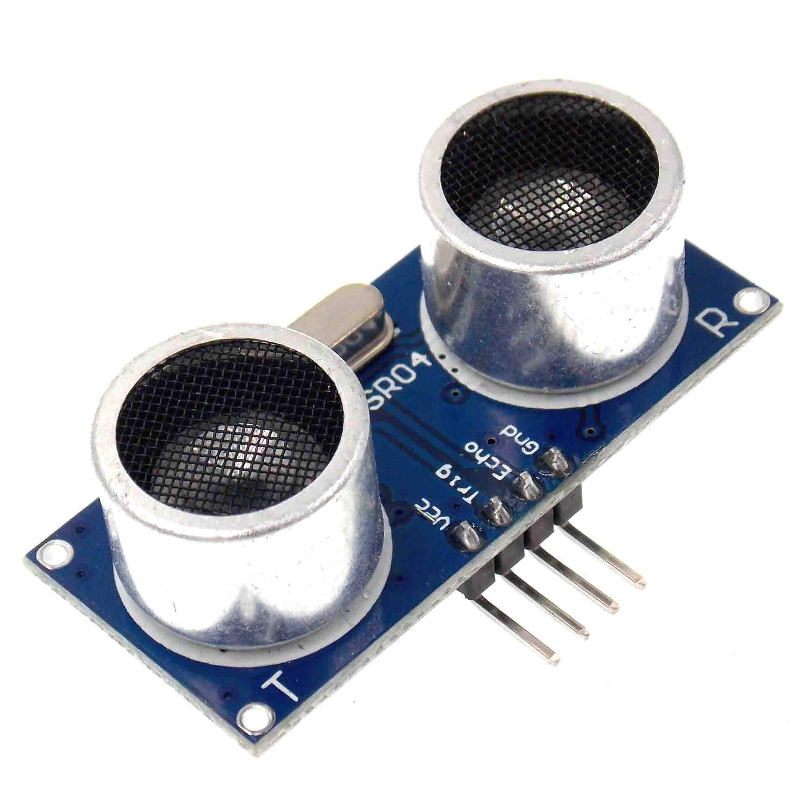
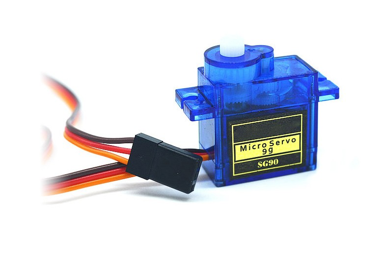

OpenCV Radar
===============

Creation
===============

Overall, if you've ever used pygame with python, that's about the idea
I went for with this implementation.  I wanted to collect data from an
outside source and do something to it, so I used an arduino kit with
a servo and ultrasonic sensor to rotate and get distance data while
live-time showing the results to the screen with a little radar I coded
up in OpenCV, and to animate it, I just "blit" the backgoround over the
drawn llines and then draw the new ones, and show the output after.

For the portion with raycasting, I used OpenGL to form a little section
where the detected distances can be explored, like you're mapping your
area and then seeing it digitally.

Usage
===============
If you want to try out the code I've created, here's what you need to 
do to be able to use it:

**Code**:
- Inside main, change the value of `const char* port_name` to the 
actual port on your machine you connect the arduino power supple to
- For compilation, if you look to the Makefile, you'll see what I
personally linked for usage, change around those path values to the 
location on your machine OpenCV and OpenGL is located
- In the arduino file, use the pins I set up, or use different ones
and remember to change their values before you send the code to the
arduino Uno

**Building**:
- For materials like arduino, you'll need:
    - *Arduino Uno Board* (to run arduino code)
    - *Arduino power wire* (to connect to machine)
    - *Ultrasonic sensor* (for sensing distance)
    - *MicroServo* (for rotation of above sensor)
    - *Wires and breadboard* (for pin connection)

Here's me using the setup and compilation I made as an example:

Here's the sensor and servo I used:

	
    

Applications
===============

The Raytracing aspect feels kind of added on, and that's because it is.
I felt the possibility that with such a collection tool, one could mark
down the distances collected and later develop a matrix representing 
the points around a central location, essentially, if you circled the 
sensor and marked down what it detected, you could map your surroundings
and then see that in the raytracing portion, like scanning your 
surroundings and then building a model off of that, which I think is 
pretty neat.

Adding on, with the proper equipment (and time), an individual could
set up a moving scanner and map out an area, so a whole room, building,
or path, and then turn that into a "map" of the location!

- 3D Scanning
- Physical modeling in an algorithm
- Building the world around us into a machine readable format